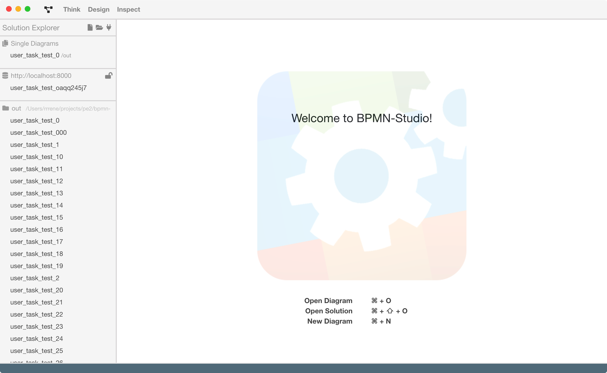
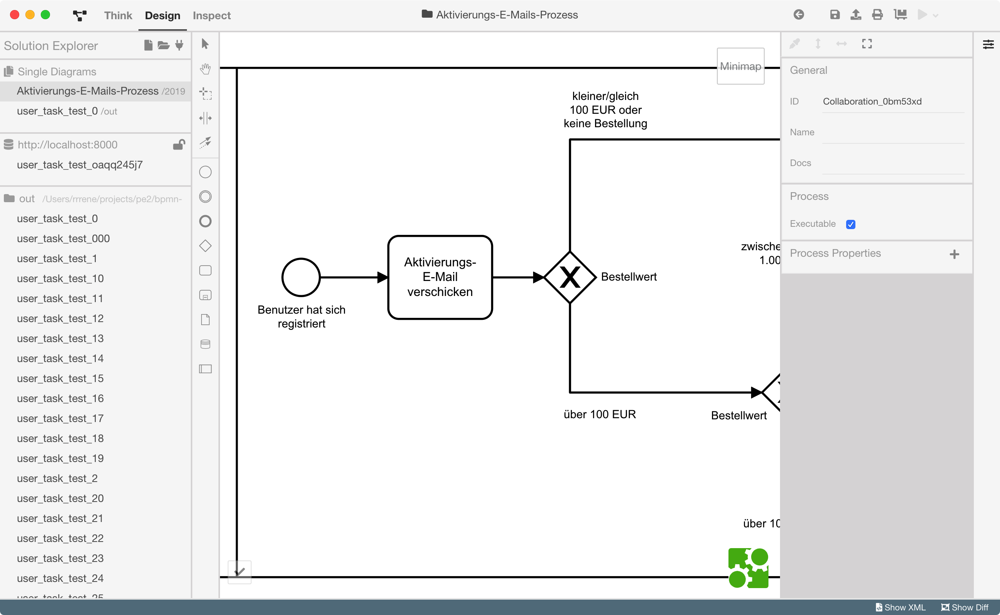

# Getting Started

> Hinweis: Die Texte in Zitatblöcken sind die TODOs des betreffenden Abschnitts.

ProcessEngine und BPMN Studio bilden eine verteilte, quelloffene Laufzeit- und Entwicklungsumgebung für BPMN-basierte Geschäftsprozesse.



## BPMN Studio und die ProcessEngine

> - Einführung BPMN Studio
> - Erklären, was passiert („es startet eine ProcessEngine“)

ProcessEngine.io ist die Workflow-Engine von [5Minds](https://5minds.de).

Im Gegensatz zu vielen anderen Lösungen in diesem Bereich ist ProcessEngine quelloffen und bietet mit BPMN Studio eine integrierte Entwicklungsumgebung zum grafischen Design von Prozessen.

ProcessEngine unterstützt so eine schnelle, iterative Entwicklung und Sie können sich auf das konzentrieren, was zählt: **Ihr Business und Ihre Nutzer.**



Mit BPMN Studio kann der Benutzer nicht nur Prozesse durchdenken, entwerfen und validieren, sondern diese auch direkt ausführen.
Denn BPMN Studio bringt eine integrierte ProcessEngine mit, welche es jedem ermöglicht, seine Prozesse auch ohne Serverlandschaft auszuführen.

Wenn BPMN Studio startet, startet sich auch eine ProcessEngine, ohne, dass der Benutzer hierzu etwas tun muss.


## Das "Hello World" der digitalen Transformation

> - Beispiel-Prozess
> - Code-Beispiele
> - hier bewusst noch keine Erklärung der Elemente - im Vordergrund steht der schnelle Zugang zu den Grundideen und zum Code

Viele Einführungstexte zu Programmiersprachen und anderen IT-Themen enthalten ein sog. "Hello World", ein bewusst einfach gehaltenes Beispiel, welches die Technologie in ihren Grundzügen präsentiert.

Für die ProcessEngine wollen wir ein Beispiel aus dem Bereich E-Commerce aufgreifen:
In einem Online-Shop sollen Nutzer im Rahmen der Registrierung einen Rabattcode erhalten und Nutzer, die besonders viel bestellen, zusätzlich einen sog. Reseller-Code, der ihnen ermöglicht besondere Mengen-Rabatte zu aktivieren.

Üblicherweise werden diese Regeln im Programmcode niedergeschrieben.


Eine Workflow-Engine ermöglicht, diese Diagramme direkt auszuführen und so zum einen die Abläufe mit allen im Team zu diskutieren (insbesondere den Fachexperten, die nicht zwingenderweise Techniker sind!) sowie Unterschiede zwischen der Dokumentation und dem Programmcode zu vermeiden.

Die Steuerung des Diagramms aus einem Skript heraus ist denkbar einfach:

```javascript
// TODO: ACHTUNG: Pseudo-Code! Bitte überarbeiten und diesen Kommentar entfernen!
const client = ProcessEngineClient.create('http://localhost:8000');

const processStartPayload = createPayload('Dies ist die Eingabe für den Prozess aus JavaScript.');

console.log(`Prozess gestartet '${PROCESS_MODEL_ID}' beim Start-Event '${START_EVENT_ID}'.`);

const result = await client.startProcessInstance(
    identity,
    PROCESS_MODEL_ID,
    processStartPayload,
    DataModels.ProcessModels.StartCallbackType.CallbackOnEndEventReached,
    START_EVENT_ID,
    END_EVENT_ID);
```

> Hinweis: Mit Abschluss dieses Abschnitts sollte der Leser die Domäne von ProcessEngine/Studio verstanden haben.
> Die folgenden Abschnitte dienen der Vollständigkeit und tieferen Darstellung der Domäne.
> **Alles wirklich notwendige sollte aber bis hierhin bereits angeführt worden sein.**

## Prozesse modellieren

### BPMN: Welche Elemente nutze ich für was?

>

### ProcessEngine: Clients in vielen Programmiersprachen und eine standardisierte JSON-API

> Beschreiben, dass es Clients gibt und was man mit denen machen kann

Die ProcessEngine verfügt über eine standardisierte JSON-API zur Steuerung von Prozessen.

Für die ProcessEngine-API existieren Clients in TypeScript, JavaScript, .NET C# und Python.

Da es sich um eine offene Schnittstelle handelt, können mit geringem Aufwand Clients in anderen Sprachen erstellt werden.

## Philosophie

> Philosophie der prozess-orientierten Software-Entwicklung beleuchten

### Schneller zum Ziel kommen, ohne Kommunikations- und Orchestrierungsaufwände

