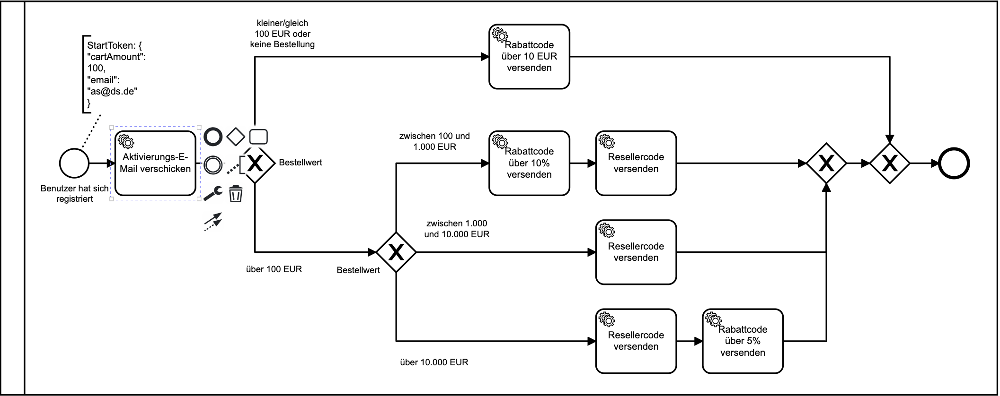
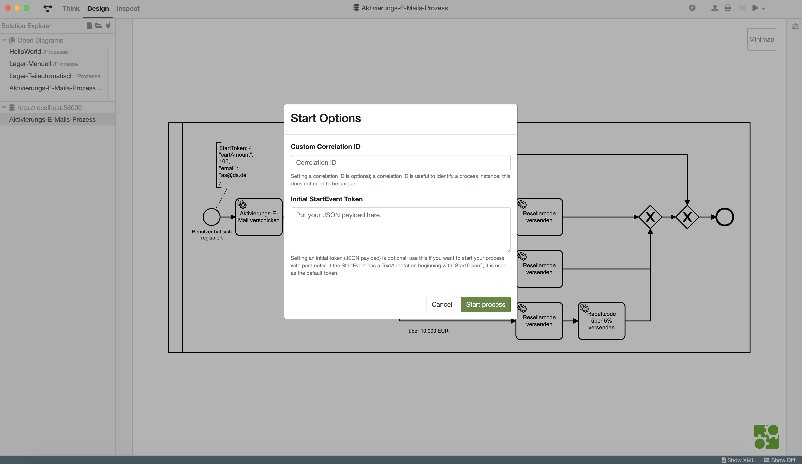
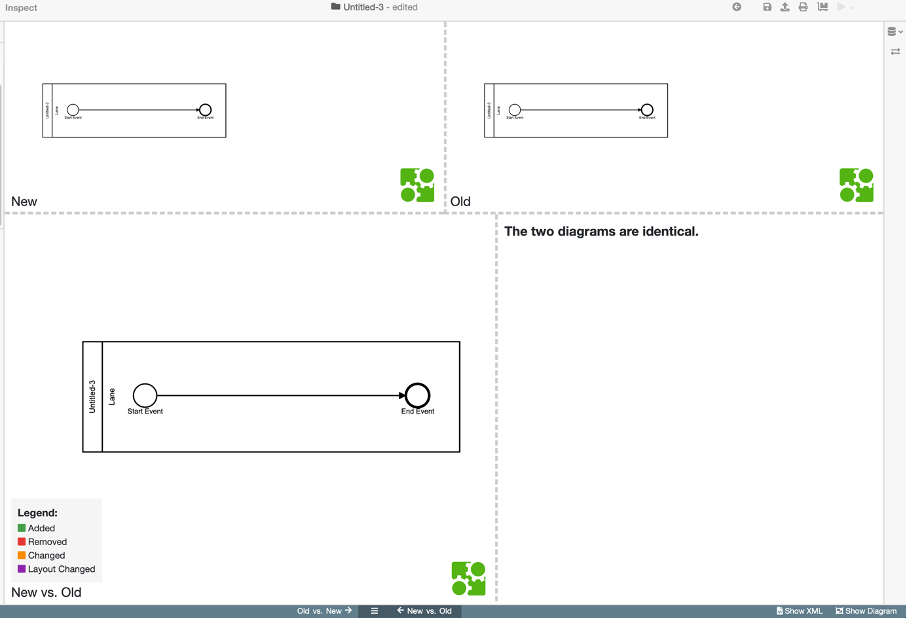
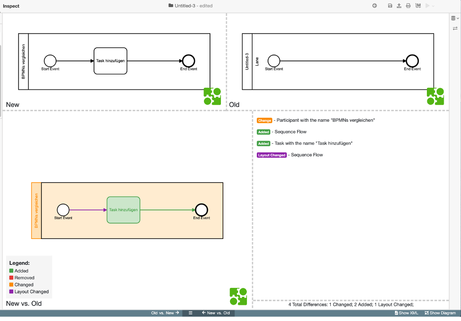
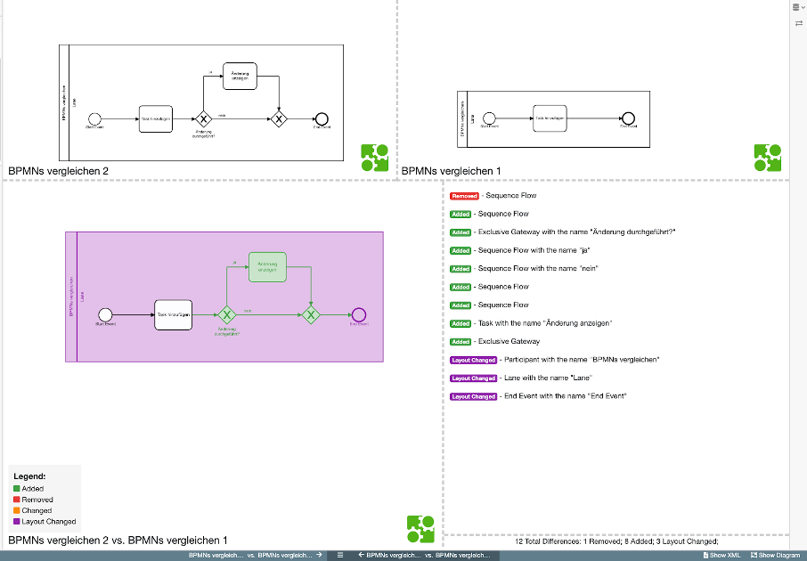

# Getting Started

AtlasEngine und BPMN Studio bilden eine verteilte, quelloffene Laufzeit- und Entwicklungsumgebung für BPMN-basierte Geschäftsprozesse.


## BPMN Studio und die AtlasEngine

Die AtlasEngine ist die Workflow-Engine von [5Minds](https://5minds.de).

Im Gegensatz zu vielen anderen Lösungen in diesem Bereich ist AtlasEngine quelloffen und bietet mit BPMN Studio eine integrierte Entwicklungsumgebung zum grafischen Entwerfen **und** Ausführen von Prozessen.

Die AtlasEngine unterstützt somit eine zielgerichtete, iterative Entwicklung und Sie können sich auf das konzentrieren, was zählt: **Ihr Business und Ihre Nutzer.**


Mit BPMN Studio kann der Benutzer nicht nur Prozesse durchdenken, entwerfen und validieren, sondern sie auch direkt in BPMN Studio ausführen.
BPMN Studio bringt hierzu eine integrierte AtlasEngine mit, welche automatisch gestartet wird und es jedem ermöglicht, seine Prozesse auch ohne Serverlandschaft auszuführen.


## Das "Hello World" der digitalen Transformation

Viele Einführungstexte zu Programmiersprachen und anderen IT-Themen enthalten ein sog. "Hello World", ein bewusst einfach gehaltenes Beispiel, welches die jeweilige Technologie in ihren Grundzügen präsentiert.

Das könnte für das Starten von Prozessen folgendermaßen aussehen.

```csharp
// C#
var client = new ProcessEngineClient("http://localhost:8000");
var result = await client.StartProcessInstance('helloWorld', 'sayHello');
```

Die Parameter haben folgende Bedeutung:

* `http://localhost:8000` - die Adresse der internen ProcessEngine des BPMN Studios
* `helloWorld` - die ID des Prozesses, den wir starten wollen
* `sayHello` - die ID des Start-Events, das wir auslösen wollen

In BPMN Studio lassen sich diese Eigenschaften bearbeiten:


Doch die Prozesse im eigenen Unternehmen sind natürlich mehr als ein Start-Aufruf.
Um die AtlasEngine und ihre Vorzüge besser darstellen zu können, wollen wir daher ein Beispiel aus dem Bereich E-Commerce aufgreifen:

**Der Online-Shop**

In einem Online-Shop sollen Nutzer im Rahmen der Registrierung einen Rabattcode erhalten.
Nutzer, die besonders viel Ware bestellen, sollen zudem einen sog. Reseller-Code erhalten, der ihnen ermöglicht besondere Mengen-Rabatte zu aktivieren.

Üblicherweise werden diese Regeln in vielen, vielen E-Mails und Gesprächen kommuniziert, bevor sie dann im Programmcode niedergeschrieben werden.
Regelmäßig scheinen einige der Anforderungen sich zu widersprechen, so dass Techniker und Nicht-Techniker in einen intensiven Dialog treten müssen, um herauszufinden, wo sich "Wunsch und Wirklichkeit" unterscheiden.

Die Lösung ist, sich gemeinsam ein Bild zu machen.

Nehmen Sie folgende Kette an Anforderungen aus einer E-Mail-Konversation:

* Wir müssen bei der Registrierung auch einen Aktivierungscode verschicken, mit dem User ihre E-Mail-Adresse aktivieren.
* Dann sollten Benutzer, die sich bei ihrem ersten Einkauf registriert haben, noch einen Rabattcode über 10% des Warenwerts, aber jeder Nutzer einen Code über mindestens 10,00 EUR bekommen.
* Falls Benutzer sich während der Bestellung erstmalig registriert haben, dann muss geguckt werden, ob sie Waren im Wert von über 1.000 EUR bestellt haben. Dann sollen sie auch einen Resellercode angeboten bekommen, zusätzlich zum Rabattcode.
* Reseller, die so viel bestellen, dürfen natürlich keinen 10%-Rabattcode kriegen
* Reseller, die sogar über 10.000 EUR bestellen, sollten natürlich trotzdem einen Rabattcode bekommen (aber nur für 5%). Aber die E-Mail dafür darf erst nach der für den Reseller-Code rausgehen!

Nach Erstellen des Prozessdiagramms sehen wir, dass die scheinbar widersprüchlichen Anforderungen weniger konfus sind als gedacht:



Eine Workflow-Engine ermöglicht, Diagramme wie dieses direkt auszuführen und so zum einen die Abläufe mit allen im Team zu diskutieren (insbesondere den Fachexperten, die nicht zwingenderweise Techniker sind!) sowie Unterschiede zwischen der Dokumentation und dem Programmcode zu vermeiden.

### Steuerung per BPMN Studio

Zunächst müssen sie [BPMN Studio](https://www.process-engine.io/downloads) und das [Diagramm](https://github.com/process-engine/getting-started/tree/develop/Prozesse) herunterladen.
Wenn Sie das Studio starten, wird automatisch im Hintergrund eine AtlasEngine-Server-Instanz gestartet.


Zum Ausführen des Diagramms müssen wir ein Deployment auf diese interne AtlasEngine vornehmen.
Dies geschieht durch einen Klick auf "Deploy to ProcessEngine" (in der Toolbar, oben rechts).


Anschließend kann das Diagramm per Klick auf "Run" ausgeführt werden (ebenfalls oben rechts in der Toolbar).


Prozesse können und müssen in gewissen Fällen mit individuellen Parametern gestartet werden. In diesem Beispiel wird erwartet, dass die Eigenschaft "shoppingCardAmount" vom Aufrufer vorgegeben wird. Die Eigenschaft wird an einem exklusiven Gateway ausgewertet, um das Prozessmodell auf einem bestimmten Pfad zu leiten. Diese Parameter können im JSON-Format in dem Feld angegeben werden.

In diesem konkreten Beispiel wird der Parameter folgendermaßen angegeben:
```json
{
  "shoppingCardAmount": 100
}
```
Mit dem Wert von mindestens 100 EUR wird der Prozess durch den unteren Sequenzfluss fortgesetzt. Andernfalls wird der Pfad genommen, der durch den oberen Squenzfluss folgt.



Während der Ausführung können Prozesse im sog. "Live Execution Tracker" analysiert werden.


Neben der Steuerung von Prozessen mit Hilfe des BPMN Studios lassen sich die gezeigten Funktionen natürlich auch durch Skripte über die AtlasEngine API automatisieren.

### Steuerung per Skript

### Starten von Prozessen

Die Steuerung des Diagramms aus einem Skript heraus ist denkbar einfach.

Wie weiter oben bereits angedeutet, lassen sich Prozesse nach dem Deployment (das muss mit BPMN Studio erfolgen) mit Hilfe des [`DotNet-Client der AtlasEngine`](https://github.com/atlas-engine/discount-example/tree/feature/update_gettingStarted/Dotnet) starten:

```csharp
// C#
class Program
    {
        private static void Main(string[] args)
        {
            StartNewProcessInstance().GetAwaiter().GetResult();
        }

        private static async Task StartNewProcessInstance()
        {
            var addressOfAtlasEngine = new Uri("http://localhost:56100");
            var client = ApiClientFactory.CreateProcessControlApiClient(addressOfAtlasEngine);

            var startToken = new { cartAmount = 10001, email = "as@ds.de"};

            Console.WriteLine("Prozess 'Aktivierungs-E-Mails-Prozess' mit Start-Event 'StartEvent' und ohne Warten auf die Response gestartet.");

            await client.StartProcessInstanceAsync("Aktivierungs-E-Mails-Prozess", "StartEvent", initialToken: startToken);

            Console.WriteLine("Prozess 'Aktivierungs-E-Mails-Prozess' mit End-Event beendet");

            Console.WriteLine("Prozess 'Aktivierungs-E-Mails-Prozess' mit Start-Event 'StartEvent' und Warten auf die Response gestartet .");

            var response = await client.ExecuteProcessInstanceAsync("Aktivierungs-E-Mails-Prozess", "StartEvent", initialToken: startToken);

            Console.WriteLine($"Prozess 'Aktivierungs-E-Mails-Prozess' mit End-Event beendet. Payload {response.TokenPayload.RawPayload}");
        }
    }
```
Der Port ist für die Instanz der AtlasEngine, die im BPMN Studio gestartet wird:

* Mit der regulären "stable" Version startet das Studio auf Port 56000 eine AtlasEngine-Server-Instanz in der aktuell stabilen Version.
* Mit der *Beta*-Version startet das Studio auf Port 56100 eine AtlasEngine-Server-Instanz in der aktuellen *Beta*-Version.

### Erstellen von External Task Workern

Das "External Task Pattern" sieht vor, dass zu erledigende Arbeiten in einem vereinheitlichten Arbeitsvorrat hinterlegt werden.
Dort können sie von "External Task Workern" abgeholt und bearbeitet werden.
Durch diese Entkopplung können die Worker in jeder beliebigen Programmiersprache implementiert werden.
Der zuständige Worker hinterlegt anschließend das Arbeitsergebnis im Arbeitsvorrat, wo die AtlasEngine es abholen und mit der Prozessausführung fortführen kann.

Das Pattern stellt somit eine Alternative zur Anbindung von REST-Service-Endpunkten dar.

Die folgende Abbildung stellt beide Konzepte gegenüber:


Ein ExternalTaskWorker für den External Task "Aktivierungs-E-Mail versenden" aus unserem Online-Shop-Beispiel könnte wie folgt aussehen:

```csharp
// C#
class Program
{
    static void Main(string[] args)
    {
        var hostBuilder = CreateHostBuilder(args);
        var host = hostBuilder.Build();

        var addressOfAtlasEngine = new Uri("http://localhost:56100");
        var client = new ExternalTaskClient(addressOfAtlasEngine, logger: ConsoleLogger.Default);

        // Create a new typed worker using a factory method:
        client.SubscribeToExternalTaskTopic(
            "Send.DiscountCode",
                p => p.UseHandlerFactory<SendDiscountCodeHandler, SendDiscountCodePayload, 
                SendDiscountCodeResult>(() => new SendDiscountCodeHandler()));

        client.StartAsync();

        host.Run();
        Console.WriteLine("Started");
        Console.ReadKey(true);

        client.Stop();
    }
}   
```


## Prozesse modellieren

### Was ist BPMN?

BPMN (Business Process Model and Notation) ist eine XML-basierte, ausführbare Modellierungssprache für Geschäftsprozesse.

Sie wurde in der Version 2.0 in [ISO/IEC 19510:2013](https://www.iso.org/standard/62652.html) standardisiert.

Die Verwendung von BPMN zur Beschreibung von Abläufen in Software ist konsequent, weil auf diese Weise

* Diagramme als ausführbare Software gesehen werden,
* die Dokumentation der Software entspricht und
* eine einfachere und verbesserte Kommunikation zwischen Teams sowie Technikern und Nicht-Technikern erreicht wird.


### BPMN: Welche Elemente nutze ich für was?

#### Tasks

Tasks ermöglichen die Beinflussung des Prozesses durch die manuelle Datenerfassung oder die Ausführung von Programmcode.

##### Service-Task


Ein **Service-Task** führt einen externen Service aus.
Diese Art Task eignet sich gut, um Aufgaben an Microservices zu delegieren, wobei die Aufgaben-Delegation in REST-API-Endpunkte und External-Task-Worker unterschieden werden kann.

##### Script-Task


Ein **Script-Task** führt ein Skript aus.
Das Skript ist als Eigenschaft des Tasks definiert und kann mit BPMN Studio bearbeitet werden.
Diese Art Task eignet sich gut, um erste Prototypen größerer Features zu implementieren.

##### User-Task


Ein **User-Task** fordert einen Benutzer auf, eine manuelle Aktion durchzuführen, wie bspw. die Bestätigung eines Vorgangs oder die Eingabe von Daten.
Diese Art Task eignet sich gut, um manuelle Prozesse schrittweise zu digitalisieren.

#### Gateways

##### XOR-Gateway


XOR-Gateways bilden Exclusik-Oder-Verzweigungen, bei denen genau ein Pfad auf Basis der am Gateway notierten Bedingung gewählt und dann abgelaufen wird.
Es gibt weitere Arten von Gateways, um bspw. parallel auszuführende Workflows zu beschreiben.

#### Event

##### Start-Event


Jeder Prozess besitzt mindestens ein Start-Event.
Start-Events können manuell, bspw. durch ein Skript wie in unserem "Hello World", durch nachrichtenbasierte sowie zeitlich gesteuerte Ereignisse ausgelöst werden.

##### End-Event


Jeder Prozess besitzt mindestens ein End-Event.
Mit Erreichen eines End-Events ist die Prozessausführung beendet. Es gibt noch viele andere BPMN-Elemente. Einen Gesamtüberblick über die weiteren BPMN-Elemente können Sie sich [hier](https://github.com/process-engine/bpmn-studio/blob/master/doc/bpmn-elements.md) verschaffen.

### ProcessEngine: Clients in vielen Programmiersprachen und eine standardisierte JSON-API

Die ProcessEngine verfügt über eine standardisierte JSON-API zur Steuerung von Prozessen.

Für die ProcessEngine-API existieren Clients in TypeScript, JavaScript, .NET C# und Python.
Da es sich um eine offen spezifizierte Schnittstelle handelt, können Clients in weiteren Sprachen mit geringem Aufwand erstellt werden.

## BPMN-Diagramme vergleichen

In diesem Abschnitt beschreiben wir Ihnen, wie Sie BPMN-Diagramme miteinander vergleichen können.
Im ersten Teil erstellen wir ein BPMN-Prozess und stellen dessen Änderungsverlauf visuell dar. Dieser Verlauf verschafft uns einen Überblick über den Fortschritt des Diagramms. Anhand der farblichen Darstellung der Änderungen, können Sie sehen, wie sich der Prozess schrittweise durch Hinzufügen von neuen Elementen entwickelt hat. 
Im zweiten Teil vergleichen wir zwei Diagramme unabhängig ihrer Modellierung miteinander und zeigen die Unterschiede auf. Diese Unterschiede werden ebenfalls farblich dargestellt.

### Änderungsverlauf eines BPMN-Diagramms
#### Wie können Sie ein neues BPMN-Diagramm erstellen?
Im Folgenden erstellen wir ein neues BPMN-Diagramm. Zum Start bietet das BPMN-Studio eine Vorlage mit einem Start- und einem End-Event in einem Prozesspool an (siehe Abbildung 1). 


Durch das Klicken der Schaltfläche Show Diff  (unten rechts in der Anwendung) zeigt das Programm die Änderungen des Diagramms im Diff Protokoll an. Da sich bis jetzt keine Änderungen ergeben haben, liefert das Diff Protokoll noch kein Ergebnis (siehe Abbildung 2).



#### Wie können Sie das neu erstellte Diagramm erweitern?
Das Diagramm erweitern sie, indem sie einen neuen Task hinzufügen (siehe Abbildung 3).


Sobald Sie dem Diagramm neue Elemente hinzugefügt haben, können Sie sich die Änderungen unter Show Diff als Protokoll anzeigen lassen (siehe Abbildung 4). In der Abbildung ist das Fenster in vier Bereiche unterteilt. Oben rechts ist  das Diagramm im Anfangszustand. Auf der linken Seite können Sie das Diagramm in der veränderten Version betrachten. Im Bereich unten links stellt das Diagramm die Veränderungen farblich dar. 

Die Farbe symbolisiert die Art der Änderung, die Sie durchgeführt haben, und wird zusätzlich unten links in der Legende angezeigt:

* Hinzugefügt (grün)
* Entfernt (rot)
* Geändert (orange)
* Layout geändert (lila)

Im Bereich unten rechts wird das Protokoll ebenfalls farblich entsprechend der Legende aufgelistet.



### Vergleich von zwei BPMN-Diagrammen
In Teil 2 vergleichen wir zwei unterschiedliche Diagramme miteinander. Zunächst klicken wir auf die Schaltfläche Show Diff. Ein Fenster öffnet sich zum Vergleich von zwei Diagrammen. Dann wählen wir die Datei aus, mit der wir das aktuelle Diagramm vergleichen wollen (siehe Abbildung 5).


Auf dem oberen Bereich der Anwendung sind beide zu vergleichenden Diagramme dargestellt (siehe Abbildung 6). Unterschiede, welche im Diagramm 1 im Vergleich zu Diagramm 2 erkennbar sind, werden unten links farblich dargestellt. 

Pools und Lanes stellen die Verantwortlichkeiten in einem Prozess dar. Ein Pool repräsentiert etwa ein Unternehmen oder eine Organisation. Ein Lane repräsentiert dagegen verschiedene Abteilungen, Rollen oder Personen in einem Prozess und damit die Prozessteilnehmern bzw. “Participant”. In diesem Fall haben wir das Layout des “Participant” vergrößert und ist in der Farbe Lila gekennzeichnet. Darüber hinaus haben wir weitere Elemente hinzugefügt, die in der Farbe grün erkennbar sind. Die zu unterscheidenden Elemente werden unten rechts im Protokoll farblich dokumentiert.



## Philosophie

### Wir entwickeln Software miteinander!

ProcessEngine ermöglicht die Anbindung von Microservices, nachrichtenbasierten Systemen und die leichte Verkettung von Komponenten.
Hierdurch erreichen wir eine transparente Choreographie der angeschlossenen Systeme und Orchestrierung von Abläufen.

Neu und wichtig ist, dass jeder im Team die Abläufe begreifen und validieren kann.
Die Software dokumentiert sich dank der Verwendung von BPMN selbst.
Das Diagramm ist Code und Dokumentation zugleich.
So bleibt die Dokumentation immer aktuell und "lügt nie".

Wenn Sie noch weitere Fragen haben, so [kontaktieren Sie doch das Team von 5Minds](https://5minds.de)!
